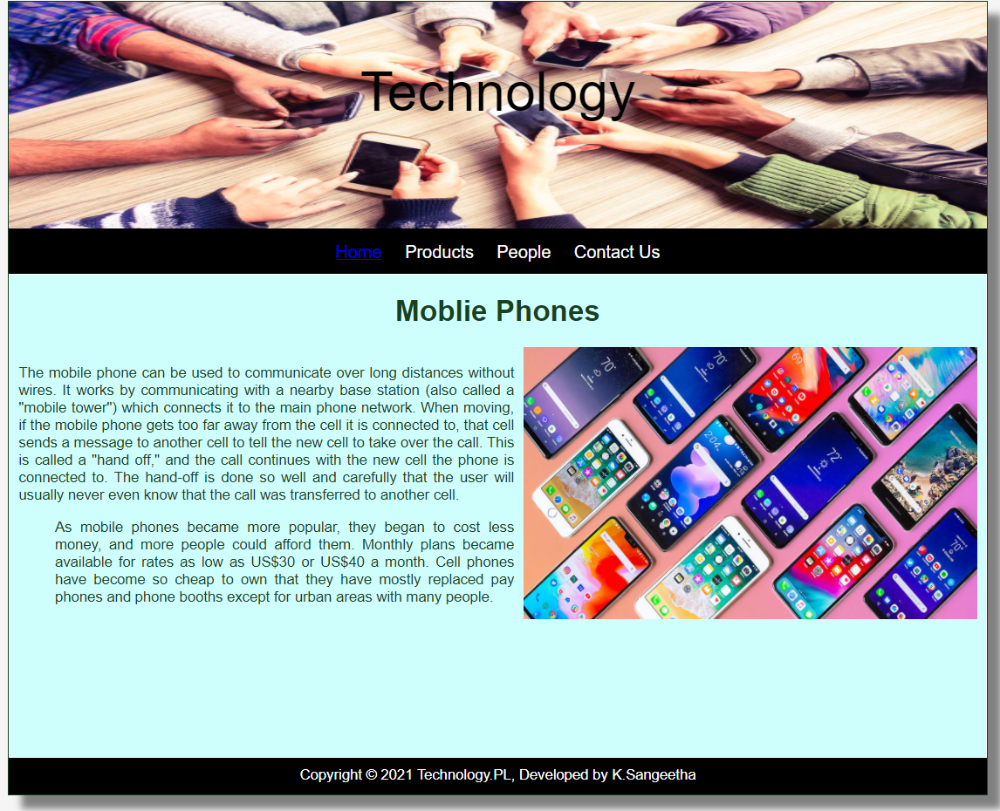
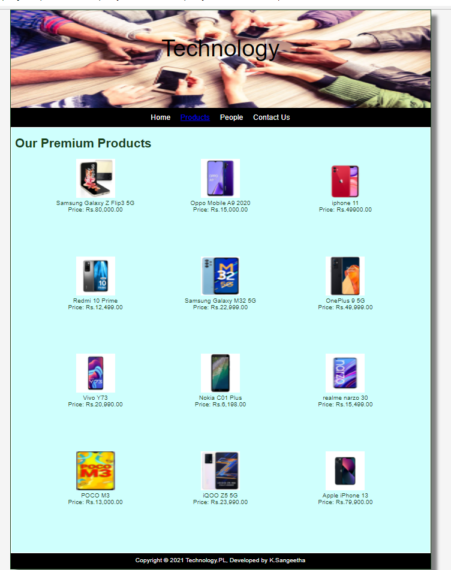

# Web Design for a Software Product Company

## AIM:

To design a static website for a software product company company.

## DESIGN STEPS:

### Step 1:

Requirement collection.

### Step 2:

Creating the layout using HTML and CSS.

### Step 3:

Updating the sample content.

### Step 4:

Choose the appropriate style and color scheme.

### Step 5:

Validate the layout in various browsers.

### Step 6:

Validate the HTML code.

### Step 6:

Publish the website in the given URL.

## PROGRAM :
1)Home Page:
```
<!DOCTYPE html>
<html lang="en">
  <head>
    <title>Technology.PL</title>
    <link rel="stylesheet" href="./css/layout.css" />
    <link rel="icon" href="./images/icon.png" type="image/x-icon" />
  </head>

  <body>
    <div class="container">
      <div class="banner">Technology</div>
      <div class="menu">
        <div class="menuitemselected"><a href="/static/home.html">Home</a></div>
        <div class="menuitem"><a href="/static/products.html">Products</a></div>
        <div class="menuitem"><a>People</a></div>
        <div class="menuitem"><a>Contact Us</a></div>
      </div>
      <div class="content">
        <div class="homecontent">
          <h1>Moblie Phones</h1>
          
          <div class="contenttext">
            <h1></h1>
            <br />
            The mobile phone can be used to communicate over long distances without wires.
            It works by communicating with a nearby base station (also called a "mobile tower") which 
            connects it to the main phone network. When moving, if the mobile phone gets too far away from the cell it 
            is connected to, that cell sends a message to another cell to tell the new cell to take over the call. 
            This is called a "hand off," and the call continues with the new cell the phone is connected to. 
            The hand-off is done so well and carefully that the user will usually never even know that the call was transferred to another cell.
            <ul>
            As mobile phones became more popular, they began to cost less money,
            and more people could afford them. Monthly plans became available for rates as low as US$30
            or US$40 a month. Cell phones have become so cheap to own that they have mostly replaced pay phones
            and phone booths except for urban areas with many people.
            </ul>
          </div>
        </div>
      </div>
      <div class="footer">
        Copyright &#169; 2021 Technology.PL, Developed by K.Sangeetha
      </div>
    </div>
  </body>
</html>


2)Product Page:

``
<!DOCTYPE html>
<html lang="en">
    <head>
      <title>Technology.PL</title>
    <link rel="stylesheet" href="./css/layout.css" />
    <link rel="icon" href="./images/icon.png" type="image/x-icon" />
  </head>

  <body>
    <div class="container">
      <div class="banner">Technology</div>
      <div class="menu">
        <div class="menuitem"><a href="/static/home.html">Home</a></div>
        <div class="menuitemselected">
          <a href="/static/products.html">Products</a>
        </div>
        <div class="menuitem"><a>People</a></div>
        <div class="menuitem"><a>Contact Us</a></div>
      </div>
      <div class="content">
        <div class="productcontent">    
          <h1>Our Premium Products</h1>
          <div class="productitems">
              <div class="productitem"> 
                  <div class="itemimage">
                  
                  </div>
                  <div class="itemname">Samsung Galaxy Z Flip3 5G </div>
                  <div class="itemprice">Price: Rs.80,000.00 </div>
              </div>
              <div class="productitem"> 
                  <div class="itemimage">
                  
                  </div>
                  <div class="itemname">Oppo Mobile A9 2020</div>
                  <div class="itemprice">Price: Rs.15,000.00 </div>
              </div>
              <div class="productitem"> 
                <div class="itemimage">
                
                </div>
                <div class="itemname">iphone 11</div>
                <div class="itemprice">Price: Rs.49900.00 </div>
            </div>
            <div class="productitem"> 
              <div class="itemimage">
              
              </div>
              <div class="itemname">Redmi 10 Prime</div>
              <div class="itemprice">Price: Rs.12,499.00 </div>
          </div>
          <div class="productitem"> 
            <div class="itemimage">
            
            </div>
            <div class="itemname">Samsung Galaxy M32 5G </div>
            <div class="itemprice">Price: Rs.22,999.00 </div>
           </div> 
          <div class="productitem"> 
              <div class="itemimage">
              
              </div>
              <div class="itemname">OnePlus 9 5G</div>
              <div class="itemprice">Price: Rs.49,999.00</div>
        </div>
        <div class="productitem"> 
          <div class="itemimage">
          
          </div>
          <div class="itemname">Vivo Y73 </div>
          <div class="itemprice">Price: Rs.20,990.00</div>
       </div>
       <div class="productitem"> 
        <div class="itemimage">
        
        </div>
        <div class="itemname">Nokia C01 Plus</div>
        <div class="itemprice">Price: Rs.6,198.00</div>
     </div>
     <div class="productitem"> 
      <div class="itemimage">
      
      </div>
      <div class="itemname">realme narzo 30 </div>
      <div class="itemprice">Price: Rs.15,499.00</div>
     </div>
     <div class="productitem"> 
        <div class="itemimage">
        
        </div>
        <div class="itemname">POCO M3</div>
        <div class="itemprice">Price: Rs.13,000.00</div>
     </div>
     <div class="productitem"> 
      <div class="itemimage">
      
      </div>
      <div class="itemname">iQOO Z5 5G</div>
      <div class="itemprice">Price: Rs.23,990.00</div>
     </div>
     <div class="productitem"> 
      <div class="itemimage">
      
      </div>
      <div class="itemname">Apple iPhone 13 </div>
      <div class="itemprice">Price: Rs.79,900.00</div>
     </div>
          </div>
          </div>        
      </div>
      <div class="footer">
        Copyright &#169; 2021 Technology.PL, Developed by K.Sangeetha
      </div>
    </div>
  </body>
</html>


3)People Page:


``
<!DOCTYPE html>
<html lang="en">
  <head>
    <title>Technology.PL</title>
    <link rel="stylesheet" href="./css/layout.css" />
    <link rel="icon" href="./images/icon.png" type="image/x-icon" />
  </head>

  <body>
    <div class="container">
      <div class="banner">Technology</div>
      <div class="menu">
        <div class="menuitem"><a href="/static/home.html">Home</a></div>
        <div class="menuitem">
          <a href="/static/products.html">Products</a>
        </div>
        <div class="menuitemselected"><a href="/static/people.html">People</a></div>
        <div class="menuitem"><a>Contact Us</a></div>
      </div>
      <div class="content">
        <div class="productcontent">
          <div class="homecontent">
                
          <h1>Meet Our Team</h1>
          <table>
            <tr> 
            <td>
              <div class="productitem"> 
                  <div class="itemimage">
                  
                  </div>
                  <div class="itemname">Bang-sik hyunk</div> <br>
                  <div class="itemprice"> CEO  </div> 
                </td>
            <td>
                <div class="productitem"> 
                    <div class="itemimage">
                    
                    </div>
                    <div class="itemname"> Thomas </div> <br>
                    <div class="itemprice">Managing Director</div>
                </td>
                <td>
                    <div class="productitem"> 
                        <div class="itemimage">
                        
                        </div>
                        <div class="itemname">Alexa</div> <br>
                        <div class="itemprice">Project Director</div>
                </td> 
            </tr>
            <tr>
                <td>
                    <div class="productitem"> 
                        <div class="itemimage">
                        
                        </div>
                        <div class="itemname">Harry</div> <br>
                        <div class="itemprice">Senior Manager</div>
                    </td>
                    <td>
                        <div class="productitem"> 
                            <div class="itemimage">
                            
                            </div>
                            <div class="itemname">Jennie</div><br>
                            <div class="itemprice"> Manager</div>
                    </td>
                    <td>
                        <div class="productitem"> 
                            <div class="itemimage">
                            
                            </div>
                            <div class="itemname">Peter</div> <br>
                            <div class="itemprice">Senior Team Leader</div>
                    </td>
            </tr>    
            </table>
            </div>
            <div class="footer">
                Copyright &#169; 2021 Technology.PL, Developed by K.Sangeetha.
              </div>
            </div>
        </body>
        </html>

4)Contactsus Page:


```
<!DOCTYPE html>
<html lang="en">
  <head>
    <title>Technology.PL</title>
    <link rel="stylesheet" href="./css/layout.css" />
    <link rel="icon" href="./images/icon.png" type="image/x-icon" />
  </head>

  <body>
    <div class="container">
      <div class="banner">Technology</div>
      <div class="menu">
        <div class="menuitem"><a href="/static/home.html">Home</a></div>
        <div class="menuitem">
          <a href="/static/products.html">Products</a>
        </div>
        <div class="menuitemselected"><a href="/static/people.html">People</a></div>
        <div class="menuitem"><a>Contact Us</a></div>
      </div>
      <div class="content">
        <div class="productcontent">
          <div class="homecontent">
                
          <h1>Meet Our Team</h1>
          <table>
            <tr> 
            <td>
              <div class="productitem"> 
                  <div class="itemimage">
                  
                  </div>
                  <div class="itemname">Bang-sik hyunk</div> <br>
                  <div class="itemprice"> CEO  </div> 
                </td>
            <td>
                <div class="productitem"> 
                    <div class="itemimage">
                    
                    </div>
                    <div class="itemname"> Thomas </div> <br>
                    <div class="itemprice">Managing Director</div>
                </td>
                <td>
                    <div class="productitem"> 
                        <div class="itemimage">
                        
                        </div>
                        <div class="itemname">Alexa</div> <br>
                        <div class="itemprice">Project Director</div>
                </td> 
            </tr>
            <tr>
                <td>
                    <div class="productitem"> 
                        <div class="itemimage">
                        
                        </div>
                        <div class="itemname">Harry</div> <br>
                        <div class="itemprice">Senior Manager</div>
                    </td>
                    <td>
                        <div class="productitem"> 
                            <div class="itemimage">
                            
                            </div>
                            <div class="itemname">Jennie</div><br>
                            <div class="itemprice"> Manager</div>
                    </td>
                    <td>
                        <div class="productitem"> 
                            <div class="itemimage">
                            
                            </div>
                            <div class="itemname">Peter</div> <br>
                            <div class="itemprice">Senior Team Leader</div>
                    </td>
            </tr>    
            </table>
            </div>
            <div class="footer">
                Copyright &#169; 2021 Technology.PL, Developed by K.Sangeetha.
              </div>
            </div>
        </body>
        </html>        


## OUTPUT:

### Home Page:

### Product Page:

### People Page:

### Contactus Page:

## Result:

Thus a website is designed for the software product company and the HTML,CSS code are validated.
